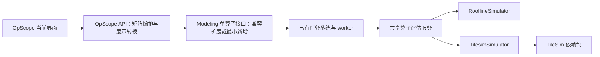

# OpScope 复用 Modeling 后端：接入设计

实现状态（2026-09-24）：核心共享链路已落地，完整迁移未结束。方案候选目录不等于最终新增文件，已实现接口/启动/限制见[当前能力](modeling-runtime.md)，阶段完成情况见[计划](modeling-backend-integration-plan.md)。

日期：2026-09-24。状态：待实施。本次只完成源码审计和方案，不代表已经接通。

实施顺序见[实施计划](modeling-backend-integration-plan.md)，原始约束见[接入试验边界](modeling-integration-scope.md)。本文以当前本地源码为依据；历史独立引擎审计不能代替接入后的能力验证。

## 1. 目标与边界

OpScope 负责配置输入、硬件×方法矩阵、任务状态、详情、比较和报告；modeling 负责算子语义、硬件规格、Roofline 与 TileSim 的实际执行和数值来源。

第一阶段保持 `zrt-sim-ui` 的页面、布局、菜单、路由和交互不变。OpScope 继续使用当前自己的页面入口，先将计算链路接入 modeling 后端。把 OpScope 页面嵌入 modeling、统一导航和重做宿主页面均不在本阶段。

接入路径必须满足：

1. Roofline 直接复用 modeling 的 `RooflineSimulator`，TileSim 直接复用其 `TilesimSimulator` 及底层 TileSim 包。不得在 OpScope 再实现一份公式、tile 选择或时延模型。
2. 必要的算子转换和 TileSim 适配补充放在 modeling 后端的共享服务中，供两个产品复用；不只藏在 OpScope 的 worker 中。
3. 请求 TileSim 就只能返回实际 TileSim 结果。无依赖、不支持或失败时明确说明，不静默切换 Roofline 或本地引擎。
4. 原 modeling 业务默认行为保持兼容；新增严格入口，不全局修改现有策略的回退规则。
5. 方法仍按真机数据、MSKPP、ESL、Roofline、TileSim 排列。前三项保持 lookup 预设，本阶段不接新数据源。校准是 Roofline 元数据，不增加方法列。
6. 成功一格就更新一格；单项失败不阻塞其他格。保留矩阵选两项比较、浮窗详情和报告。
7. 硬件和算子数据也复用 modeling 的资产、加载器与版本机制。集成模式不再维护第二套在线规格、算子定义或默认参数；数据和执行共同以 modeling 为权威来源。
8. 以轻量接入为原则：先直接复用，再兼容扩展，最后才新增。每个新增模块、接口或依赖都必须对应已核实的缺口，不能为了结构完整再造一套平台。

## 2. 源码核查结果

核查基线：OpScope 本地 `cff6e6b` 加现有未提交改动；modeling 本地 `f571e9f`。这不是未来落地时锁定的远端版本，实施前必须重新对齐。

| 位置 | 当前行为 | 接入决策 |
| --- | --- | --- |
| OpScope `opscope/evaluation/engine_worker.py`、`bundled_roofline.py`、`catalog_roofline.py` | 执行 OpScope 自己的 Roofline 实现 | 集成模式不再进入这些计算路径 |
| OpScope `opscope/evaluation/tilesim_worker.py`、`tilesim_adapters.py`、`tilesim_contract.py` | 独立加载 TileSim，包含模型选择、参数转换、逻辑工作量等 | 集成模式由 modeling 统一处理，OpScope 只做传输与展示转换 |
| modeling `backend/simulator/backends/roofline.py` | 真实 Roofline 实现，包含校准及算子逻辑；部分入口允许通用处理 | 复用实现，但不能仅凭 `can_simulate` 判定所有算子已验证支持 |
| modeling `backend/simulator/backends/tilesim.py` | `can_simulate` 实际调用预测并缓存时延；`simulate` 读取时延并调用 Roofline 补充指标 | 能力目录不能反复调用 `can_simulate`；同次执行使用同一实例，避免重复预测 |
| modeling `backend/policy_model/priority_model.py` | TileSim 优先策略仍含 Roofline 回退 | 新入口直接选择目标 simulator，不复用允许回退的策略链 |
| modeling `backend/web/services/train/op_sim.py` | 已有单算子构造逻辑和 11 个基础模板，通过策略执行 | 可提取共享构造逻辑，不能原样转发后就宣称严格复用完成 |
| modeling `backend/web/services/infer/op_sim.py` | 依赖资产、维度绑定和 Kepler 执行路径 | 不把整个推理服务的结果直接改名为本次两个方法 |
| modeling `backend/simulator/backends/utils.py` | TileSim 输入固定 `backend_type="theo"`，存在跨型号映射 | 默认只声明当前理论模式能力；型号映射必须显式记录 |
| modeling `backend/web/services/job_store.py`、`backend/worker/jobs/train.py` | 已有任务提交、worker、状态和结果机制 | 新增任务操作并复用这些基础设施，不另造 modeling 内的任务队列 |

### 必须保留的结果边界

- modeling 当前 TileSim 总时延来自 TileSim；`compute_us`、`memory_us`、FLOPs、读写量、算术强度及部分瓶颈信息由 Roofline 补充，不能呈现为 TileSim 原生流水分解。
- 当前适配器没有向上提供完整的原生事件、tile 搜索过程或连续百分比。界面不能把阶段状态伪装成真实进度，也不能从总时延编造事件。
- `do_special_op` 存在 dtype 和 shape 转换，例如 FP8 改 INT8。硬件映射也存在其他 GPU 型号映射到 H200 的情况。这些不能无条件视为同一配置。
- `RooflineSimulator(calibration=None)` 并不等于关闭校准；需要基于真实实现规定默认、指定或关闭校准的行为，不能自行猜测参数含义。
- 现有共享模拟缓存的键不能充分区分方法、完整硬件规格及校准版本。新服务不能直接共用这种结果缓存。
- 本轮检查的 modeling `.venv` 未发现可导入的 `api`、`core`、`tilesim`，也未发现对应包安装元数据。这只说明该解释器尚不满足依赖，不代表其他环境也缺失。OpScope wheel 的安装布局与 modeling 的导入方式不同，必须单独验证兼容性。

## 3. 推荐结构与职责

选择 HTTP 接口作为第一阶段边界。两个仓库都有顶层 `backend` 包，直接拼接 `PYTHONPATH` 或交叉导入应用容易冲突；HTTP 也允许计算环境与页面服务分开部署。页面仍访问自己的 `/api/opscope`，由 OpScope 后端转发和整合任务，避免浏览器跨域及页面大改。

modeling 优先提取或扩展既有单算子服务；确实需要独立模块时，可置于 `backend/operator_evaluation/`。共享执行部分只依赖 IR、硬件 registry 和模拟器，不依赖 Web Request、页面或 OpScope 包。Web/worker 向下调用服务，不反向依赖。该目录是候选组织方式，不是必须新建的子系统。

OpScope 的 `EvaluationRuntime` 增加 provider 边界，新增远程 provider。它可以校验字段结构、转发配置、管理格子与任务 ID 对应、转换单位及结果展示；不得重新推导 FLOPs、预测时延、硬件峰值或模型分项。

不把 OpScope 的整个 FastAPI 应用挂到 modeling：其静态兜底路由、应用生命周期及本地访问限制不能直接替代宿主的鉴权和生命周期。

### 轻量化约束与复用优先级

1. **已有能力直接调用。** 优先复用 modeling 的 `/api/assets/operators`、`/api/assets/hardwares`、基础算子目录及既有 jobs 查询/结果/取消接口；复用其鉴权、资产版本、存储、worker、配置加载与日志机制。必要目录归一化只做字段适配，不增加一套资产数据库或同步任务。
2. **接口不足先兼容扩展。** 核实 `/api/train/simulate/op` 能否以默认行为不变的可选严格模式满足需求；只有无法安全兼容时才新增严格提交入口。无论用哪个 URL，严格方法、版本和字段来源的要求不变。目录字段能在原接口补齐时，不再平行建立同内容目录接口。
3. **OpScope 保留最小职责。** 界面、批次到任务 ID 的对应、请求/结果转换、当前图表与报告。不新增调度器、数据库、账号体系、模型插件框架或独立缓存服务；远程 provider 先是一份具体适配实现，不扩展成通用引擎平台。
4. **复用现有展示实现。** 保留当前矩阵、详情、比较与报告生成模块，按新结果契约调整；不因接入另造一套报告系统。已有宿主报告如确实满足相同契约再复用，不为了复用牺牲当前功能。
5. **依赖按实际职责收缩。** OpScope 集成运行环境不安装 TileSim、科学计算运行依赖或复制 modeling 源码，不要求本地 modeling 路径。先使用项目已有通信与验证能力；只有明确无法满足时才引入新依赖并解释用途。
6. **迁移保留不等于长期双维护。** 旧独立引擎暂留作验收与显式回退；接入完成后清理重复计算和数据依赖。离线展示可继续保留，不以此为由长期维护第二套建模后端。

目录缓存、批量接口、额外服务等均按已观测需要增补，第一版不预先建设。轻量化不省略必要的鉴权、版本校验、来源标注与错误处理。

### 算子、硬件、方法三者解耦

| 对象 | modeling 负责 | OpScope 负责 |
| --- | --- | --- |
| 算子 | 稳定语义 ID、语义等价关系、张量角色、shape/dtype/layout、属性、输出推导和合法性 | 按后端分组展示表单、说明、输入形式和提交用户选择 |
| 硬件 | registry 规格、版本、每方法配置、实际映射目标和缺项 | 选择、排序、展示型号与支持状态 |
| 方法 | 严格执行、合法选项、依赖状态、校准及结果来源 | 方法列、任务状态、指标与比较展示 |

算子用统一语义 ID，不把训练/推理来源作为用户必须选择的分类。MatMul/batch、LayerNorm/RMSNorm、融合/非融合等只在数学和张量语义一致时合并；内部映射仍保留可追溯的源资产 ID。

在线能力目录由 modeling 提供，包含算子×方法×硬件×dtype/模式的约束。OpScope 内置目录保留给离线示例，不再作为在线请求的唯一白名单；避免新硬件或算子被“比较项不在内置目录”拒绝。硬件同名不能代替同规格，不拿 TileSim 每核配置填造整卡 Roofline 峰值。

### 硬件与算子数据复用范围（2026-09-24 补充）

复用包括目录和实际执行所需的数据，不能只复用名称列表、仍从 OpScope 本地 JSON 读取参数。当前已核实的来源如下；以下均为 modeling 仓库内路径，TileSim 包内配置除外。

| 数据 | 现有来源 | 接入方式 |
| --- | --- | --- |
| 硬件原始规格 | `backend/hardware/train/`、`backend/hardware/infer/`；可能存在部署配置覆盖 | 通过 `backend/hardware/builtin_hardware.py` 解析生效配置，不由 OpScope 自行读 YAML 或复制峰值 |
| 硬件结构、单位和加载 | `backend/hardware/spec.py`、`backend/hardware/builtin_hardware.py`；`backend/train/zrt/hardware/registry.py` 是兼容转导出 | 复用统一类型和加载规则，保留整卡/单核、Server/POD、dtype 峰值、带宽和配置来源的区别 |
| TileSim 硬件模型 | `backend/simulator/backends/utils.py` 的映射，以及已安装 TileSim 包的 `core/config/arc_config/` | modeling 解析映射与实际包内配置，返回模型身份/版本/指纹及缺项；不在 OpScope 再维护映射或复制配置 |
| 基础算子模板 | `backend/web/services/train/op_sim.py` 的 `OP_CATALOG` 及构造/输出推导逻辑 | 在 modeling 中共享目录构造能力，保留输入角色、shape/dtype、属性和输出语义 |
| 算子资产 | `backend/inference/data/operators/` 的 JSON、`backend/web/services/infer/operator_catalog.py` 的目录辅助逻辑 | 通过 modeling 的资产解析与规范化服务提供定义；已有公式或工作量描述由 modeling 解释执行，不下放给 OpScope 重算 |
| 用户可见算子/硬件及版本 | `backend/web/routes/assets.py`、`backend/infra/database/task_store_assets.py`；内置资产初始化见 `backend/infra/database/startup_assets.py` | 复用现有资产查询、版本和可见性规则；目录包含有权访问的内置/用户资产，不绕过资产层扫描数据库或导出全部私有数据 |
| 校准及方法参数 | 现有 Roofline 校准加载链、`backend/hardware/train/op_calibration/`、`backend/hardware/infer/op_compute_utilization/` 等实际被所选路径使用的数据 | 由 modeling 决定该方法实际使用哪些数据并记录版本，不因找到文件就强行混入另一条模型路径 |

具体复用字段包括：硬件型号/规格边界、各精度矩阵和向量峰值、存储容量/带宽及模拟器使用的层次参数；算子的输入/参数/输出角色、形状约束、dtype、布局、属性、默认值、融合边界，以及现有语义和计算描述。目录存在不代表每个方法都支持，未被所选模型消费的参数不得标成生效。

在线查询通过新增评估目录接口调用已有资产服务，避免 OpScope 耦合内部文件布局。第一阶段只读复用资产，不增加 OpScope 侧的资产编辑或同步写回功能。算子/硬件的新增和修正仍在 modeling 完成；OpScope 刷新目录后可见，是否可运行还要检查方法适配。

版本和一致性规则：

1. 目录响应带资产 ID、具体版本/内容摘要及权限过滤后的目录版本；请求携带选中的算子和硬件版本，而非仅名称。算子输入允许用户修改的值由 schema 指定，不复制另一套默认值。
2. 后端执行前按版本解析资产并保存有效配置快照。版本已删除、不可见或与客户端要求不符时明确返回错误，不悄悄换成最新版本。历史结果始终使用执行时快照。
3. 同名 train/infer 硬件规格不自动混合取字段；由 modeling 显式选择配置档案，真实差异保留为中性的“规格配置”选项或明确支持限制。界面不恢复训练/推理分类。
4. 算子名称去重的语义关系放在 modeling 的共享目录层；仅大小写相近或多一个 batch 不构成等价证明。OpScope 只消费统一分组和输入形式，不再独立判断数学等价。
5. OpScope 可以缓存带版本的目录以降低请求量，但按用户可见性隔离；刷新失败时说明目录过期，实际提交仍由 modeling 校验版本。不得改用本地旧规格继续计算。
6. modeling 缺少数据时仍返回缺项。不能从旧 OpScope 快照补值；如果发现旧快照中确有可信补充，应在 modeling 经过来源核验、适配和测试后统一补入。

OpScope 当前的 `data/modeling-catalog.json`、`opscope/evaluation/data/roofline_hardware.json`、`opscope/evaluation/data/operator_specs.json` 及本地算子参数/硬件映射，迁移时逐项退出集成模式的执行依赖。它们暂时只服务明确保留的独立模式、离线示例和历史快照，不能成为远程目录失败后的隐式兜底。展示名称、顺序、颜色等纯 UI 配置仍可由 OpScope 管理。

## 4. 接口与结果契约

以下定义需要满足的契约。路径是无法通过既有接口安全兼容时的候选新增方案，不要求全部新建；优先复用/扩展上述 assets、单算子及 jobs 接口，最终路径在实施时纳入 modeling OpenAPI。

- `GET /api/operator-evaluations/capabilities`：目录版本、后端版本、方法可用性及已验证支持约束；不执行耗时预测。
- `GET /api/operator-evaluations/operators` 与 `/api/operator-evaluations/hardwares`：对既有可见资产服务的规范化只读视图，提供输入 schema、规格配置和版本；大型目录支持分页/按 ID 获取详情，不把全部资产原文塞入 capabilities。
- `POST /api/operator-evaluations`：提交一个算子、一个硬件、一个方法，返回 `202` 和任务 ID；复用宿主任务查询、结果及取消机制。
- 批量选择由 OpScope 编排成多个单项任务；并发受配置限制，先从小并发验证，不能无限提交。

基础 URL 必须支持 modeling 的部署前缀，不能硬编码根路径。复用宿主现有身份验证和资源可见性；OpScope 转发经过确认的用户上下文，不接受请求正文任填 owner 作为权限依据，不硬编码共享用户。若生产身份依赖可信网关，验证并沿用该信任边界；不得让公开客户端伪造身份头。

### 输入

| 字段组 | 内容 |
| --- | --- |
| `operator` | canonical ID、源资产 ID/版本或内置模板版本、输入张量角色/shape/dtype/layout、算子属性；输出由 modeling 推导并校验 |
| `hardware` | 已注册或已授权可见的资产 ID、具体配置版本与规格档案；不接受服务器任意文件路径 |
| `method` | `roofline` 或 `tilesim`，不得用自动策略替代 |
| `options` | modeling 明确支持的校准、模式等白名单配置；不存在的模式直接拒绝 |
| `request_id` | 客户端单项请求标识，用于网络重试幂等，不能代替完整计算配置哈希 |

后端返回规范化配置及哈希；审计能够对照原始输入和有效输入。首阶段默认严格模式：等价的布局转换可以执行并记录，非等价 dtype/硬件替代不能悄悄执行。需要近似能力时后续显式增加选项，标注近似并限制比较。

### 输出

| 字段组 | 最低要求 |
| --- | --- |
| 身份 | schema 版本、任务/请求 ID、规范化配置、请求和实际算子/硬件/方法 |
| 来源 | modeling revision、依赖版本、硬件配置指纹、校准身份、模式、`synthetic=false` |
| 状态 | 排队、执行、成功、不支持、缺输入/规格/依赖、失败、取消等结构化状态及原因码；与宿主状态做明确映射 |
| 数值 | 总时延及单位/计时边界；可选 FLOPs、字节、计算/访存时间、利用率等，每项记录来源和是否有效 |
| 详情 | 实际有效参数、转换/近似说明、可选原始结果或任务 artifact 引用 |
| 进度/事件 | 仅输出模拟器实际提供的数据；只有阶段时返回阶段，无连续百分比时百分比为空 |

数值字段采用明确来源，例如 `tilesim.native`、`roofline.supplement`、`derived`；派生项也由 modeling 返回公式口径。TileSim 的总时延成功时，缺少可选 Roofline 补充不应让主结果丢失；可选项为空并说明原因。这一解耦在 modeling 后端实现，保留现有接口默认兼容行为。

缺失是 `null`，零是合法值。不能把 `SimResult` 的默认零自动认定为已计算，也不能把所有零替换为空；按字段生成路径判定有效性。失败不能包装成成功的零时延。

每次执行构建新节点，避免复用节点上的旧 `sim_result`；第一版不引入跨请求数值缓存。未来如需缓存，键须覆盖方法、算子语义和全部有效配置、硬件配置、校准、模型版本，且按用户资源权限隔离。

## 5. 任务和展示行为

modeling 持有实际执行任务与结果；OpScope 持有矩阵批次及单项任务引用。请求重试不能启动重复任务；单个失败/超时有独立终态；取消批次要传播到仍在执行的子任务。前端刷新后能否恢复全部历史须按存储能力明确说明，本阶段不承诺重做 OpScope 的历史持久化。

沿用当前逐卡 revision/轮询协议：收到一个终态就发布一个结果，不等待整批完成。排队、运行和未知进度分别展示；不得按已耗时推算 TileSim 百分比。连接中断只能报告连接状态，不能假称远程任务已取消。

详情、JSON 和报告同步显示实际后端、配置与字段来源。总时延比较须验证算子工作负载、计时边界与近似状态；不同硬件/方法本身是允许的比较维度，但要并列标明。真实不可比时可并排展示，不计算误导性的提升率。已有从 OpScope 本地引擎产生的历史结果保留原来源，不能改标为 modeling 结果。

## 6. 能力保留与缺口处理

先用小型 FP16 MatMul 打通两种方法；其后逐项核对当前 OpScope 目录。现有 train 模板与 infer 资产都要进入覆盖表，不能仅完成 11 个基础模板就宣布全目录完成。

缺口分类必须指明责任和文件：

| 原因 | 处理位置与原则 |
| --- | --- |
| modeling 已支持，但 OpScope 未映射 | 修正规范化输入/展示映射，不复制模型 |
| modeling 算子构造或共享调用未覆盖 | 在 modeling 共享执行服务中补适配及测试 |
| TileSim 底层不支持 | 记录不支持，不用 Roofline 顶替 |
| 硬件峰值/带宽等原始数据缺失 | 在 modeling 硬件规格处补有来源的数据；无数据保持缺失 |
| 包缺失、ABI 或 API 版本不兼容 | 修正 modeling 环境依赖及其包适配，不调用 OpScope 的解释器兜底 |
| 当前 modeling 没有工程模式/事件输出 | 可另阶段在 modeling 暴露真实能力；期间 UI 显示缺项 |

本阶段不要求新旧 OpScope 数值强行一致：两套实现可能有不同校准、公式与模式。验收基准是“modeling 同一个模型、同一有效配置，通过共享服务与通过 OpScope 调用一致”，旧结果只用于发现差异并解释。

## 7. 迁移与回退

新增明确的 provider 选择和 modeling 服务地址，仅配置实际需要的项目。启用 modeling provider 后，任何失败均不得落回本地 provider；独立模式如需保留必须显式选择，并保留原来源标识。

先不删除独立引擎、wheel、离线示例和历史报告。完成覆盖对照及验收后，再决定删除在线重复引擎和本地 TileSim 运行依赖；离线展示仍可独立使用。迁移回退是显式恢复原 provider/版本，不篡改既有任务结果。

部署可在同一设备或不同设备，OpScope 无需 TileSim Python 环境；计算依赖由 modeling 管理。集成模式不要求 OpScope 知道 modeling 源码绝对路径。

## 8. 验收标准

1. `zrt-sim-ui` 无本次源码变更，原 modeling 页面及后端回归通过。
2. 两种方法均有真实成功样例；相同模型配置的原生调用、共享服务与 OpScope HTTP 调用关键数值/缺失状态一致。
3. TileSim 不可用或主动失败时，卡片明确缺依赖/失败，绝不出现 Roofline 或本地结果冒充成功。
4. 输入、硬件、dtype、模式与校准版本可追踪；非等价替换不被默许。
5. 同时运行两种方法、不同校准或硬件时无缓存/节点结果污染。
6. 逐卡更新、混合成功失败、取消、超时、重复提交以及详情、双卡比较、JSON/HTML 报告验证通过。
7. 完整目录产生支持/不支持/缺数据清单，不把未验证组合声明为支持，不用旧的 9,500 格审计替代新接入证据。
8. 在 OpScope 不安装本地建模依赖的环境中，仍能通过 modeling 服务成功评估，证明计算来源已解耦。
9. modeling 新增/更新硬件或算子后，OpScope 刷新即可读取新版本，无须重新生成本地快照；旧任务不受新版本影响，过期/越权请求被明确拒绝。
10. 集成环境去掉 OpScope 本地算子/硬件执行快照，仍能列目录、配置并评估；证明复用的是完整数据链，而不只是名称。
11. 交付时列出实际复用项、必要新增项和移除依赖；每个新增接口/模块有对应缺口，不新增第二套任务、资产或权限系统。记录集成安装依赖和进程数，证明计算依赖留在 modeling。
